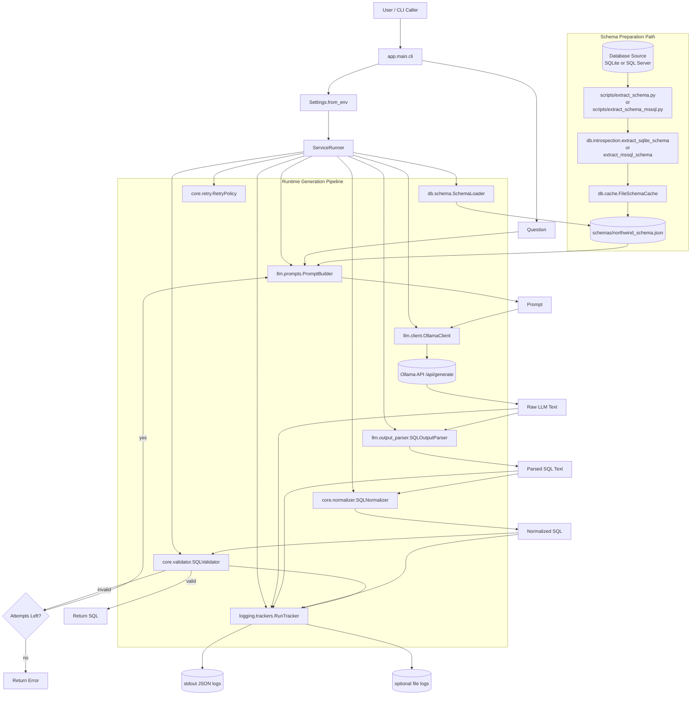

# SQL Agent (Local Text-to-SQL, SQL-Only)

`sql-agent` is a local Text-to-SQL generator that converts natural-language questions into SQL using a local Ollama model (default: `gemma3:4b`).

It is intentionally a controlled generation service:

- Input: user question
- Context: cached DB schema
- Output: SQL string only
- No SQL execution, no DB writes, no BI features

## What This Project Does

The application provides a deterministic pipeline around an LLM so output is constrained and auditable:

1. Load runtime configuration from environment variables.
2. Load schema JSON extracted from SQLite or SQL Server.
3. Build a strict prompt with rules + schema + question.
4. Call Ollama `POST /api/generate`.
5. Parse model output into SQL text.
6. Normalize SQL format.
7. Validate SQL safety and schema compatibility.
8. Retry generation once (configurable) if validation fails.
9. Return SQL or a structured failure.
10. Emit structured run logs for each attempt.

## Full Architecture Mermaid Chart



## Project Structure and Responsibilities

```text
app/
  main/cli.py                         # CLI entry point
  main/runner/service_runner.py       # Dependency wiring and orchestration bootstrap
  config/settings/__init__.py         # Environment-driven runtime config
  llm/client/ollama_client.py         # Ollama HTTP client (JSON + NDJSON handling)
  llm/prompts/prompt_builder.py       # Prompt assembly with schema and rules
  llm/output_parser/sql_output_parser.py
                                      # Output cleanup (remove fences/prose blocks)
  db/introspection/sqlite_schema_introspector.py
                                      # SQLite metadata extraction
  db/introspection/mssql_schema_introspector.py
                                      # SQL Server metadata extraction (multi-schema)
  db/schema/schema_loader.py          # Load cached schema JSON
  db/cache/file_schema_cache.py       # Persist schema snapshots
  core/pipeline/sql_generation_pipeline.py
                                      # Main generation loop + retry + logging payload
  core/validator/sql_validator.py     # Safety/schema checks (CTE-aware)
  core/normalizer/sql_normalizer.py   # SQL formatting normalization
  core/retry/retry_policy.py          # Retry strategy
  logging/trackers/run_tracker.py     # Structured logging to stdout/file

scripts/
  extract_schema.py                   # Build schema JSON from SQLite DB
  extract_schema_mssql.py             # Build schema JSON from SQL Server DB
  run_local.py                        # Convenience local runner
```

## Runtime Behavior in Detail

### 1) Configuration

`Settings.from_env()` reads all operational values from environment variables with safe defaults and type parsing.

### 2) Prompting

`PromptBuilder` composes:

- System-level SQL-only behavior
- Explicit output rules (single statement, no markdown/prose)
- Full schema in text form
- User question

### 3) LLM I/O

`OllamaClient` calls `POST {OLLAMA_URL}/api/generate` with `stream=false`.  
Response decoding supports both:

- Regular JSON objects
- NDJSON-style multi-line chunks (concatenates `response` parts)

### 4) Post-processing

`SQLOutputParser` removes markdown fences and trims extra prose blocks.  
`SQLNormalizer` ensures trailing semicolon consistency.

### 5) Validation and Safety

`SQLValidator` enforces:

- Exactly one SQL statement
- Read-only constraints (`SELECT` / `WITH ... SELECT`)
- No DML/DDL (`INSERT/UPDATE/DELETE/CREATE/DROP/ALTER`)
- Tables/columns must exist in schema
- CTE aliases are accepted as non-physical table names

### 6) Retry and Result

On validation failure, pipeline retries with corrective feedback embedded into the next prompt.  
Final result:

- Success: `{"ok": true, "sql": "...", "attempts": n, "run_id": "..."}`
- Failure: `{"ok": false, "error": "...", "attempts": n, "run_id": "..."}`

### 7) Observability

Each attempt logs structured JSON fields such as:

- `ts`, `service`, `env`, `run_id`, `attempt`
- `question`, `raw_output`, `parsed_output`, `normalized_sql`
- `valid`, `reason`

Logs can be sent to stdout and optionally to file.

## Installation

### macOS / Linux

```bash
python3 -m venv .venv
source .venv/bin/activate
pip install -r requirements.txt
```

### Windows (PowerShell)

```powershell
python -m venv .venv
.venv\Scripts\Activate.ps1
pip install -r requirements.txt
```

## Setup and Run

1. Copy env template.

```bash
cp .env.example .env
```

2. Prepare database source:
   SQLite file (`data/databases/northwind.db`) or SQL Server connection details.
3. Extract schema cache.

```bash
python scripts/extract_schema.py --db data/databases/northwind.db --out schemas/northwind_schema.json
```

SQL Server (all schemas):

```bash
python scripts/extract_schema_mssql.py --server localhost --database Northwind --trusted-connection --out schemas/northwind_mssql_schema.json
```

SQL Server (selected schemas only):

```bash
python scripts/extract_schema_mssql.py --server localhost --database Northwind --trusted-connection --schemas dbo,sales --out schemas/northwind_mssql_schema.json
```

4. Start Ollama and ensure model exists.

```bash
ollama run gemma3:4b
```

5. Run CLI.

```bash
python -m app.main.cli --question "List the top 5 customers by number of orders"
```

## CLI Usage

### SQL-only output (default)

```bash
python -m app.main.cli --question "..."
```

### JSON output with metadata

```bash
python -m app.main.cli --question "..." --output json
```

### Collapse SQL to one line

```bash
python -m app.main.cli --question "..." --single-line
```

## Environment Variables

- `SQL_AGENT_ENV` default `development`
- `SQL_AGENT_SERVICE_NAME` default `sql-agent`
- `SQL_AGENT_OLLAMA_URL` default `http://localhost:11434`
- `SQL_AGENT_MODEL` default `gemma3:4b`
- `SQL_AGENT_TEMPERATURE` default `0.1`
- `SQL_AGENT_SQL_DIALECT` default `sqlite` (`sqlite` or `tsql`)
- `SQL_AGENT_SCHEMA_PATH` default `schemas/northwind_schema.json`
- `SQL_AGENT_PROMPT_VERSION` default `v1`
- `SQL_AGENT_MAX_ATTEMPTS` default `2`
- `SQL_AGENT_REQUEST_TIMEOUT_SEC` default `120`
- `SQL_AGENT_LOG_FORMAT` default `json`
- `SQL_AGENT_LOG_TO_STDOUT` default `true`
- `SQL_AGENT_LOG_TO_FILE` default `false`
- `SQL_AGENT_LOG_PATH` default `logs/runs.jsonl`

## Limitations

- No SQL execution or result validation against live DB.
- Alias-level column lineage is intentionally permissive in MVP validator.
- Full-schema prompting is used for Northwind-scale databases; retrieval is scaffolded but not active.
- Quality depends on schema quality and prompt strictness.

## Troubleshooting

- `Unknown table: <cte_name>`:
  Ensure latest validator is used (`core/validator/sql_validator.py`) with CTE-aware checks.
- JSON decode error from Ollama:
  Client supports JSON and NDJSON; verify Ollama endpoint is correct and proxy is not altering response.
- `ModuleNotFoundError: app` while running scripts:
  Run from repository root, or use `PYTHONPATH=.` for direct script execution.
- Logs clutter SQL output:
  Set `SQL_AGENT_LOG_TO_STDOUT=false` and/or use `--output sql`.

## 12-Factor Notes

- Config strictly from environment.
- Dependencies captured in `requirements.txt`.
- Backing services (Ollama, database source, schema cache) treated as attached resources.
- Logs emitted as event stream.
- Stateless process model suitable for horizontal scaling of request workers.
